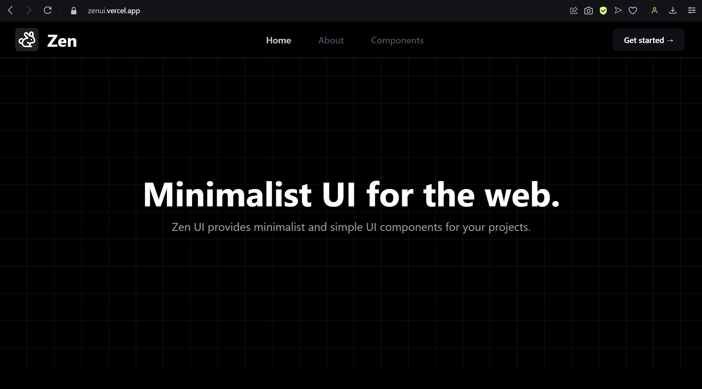
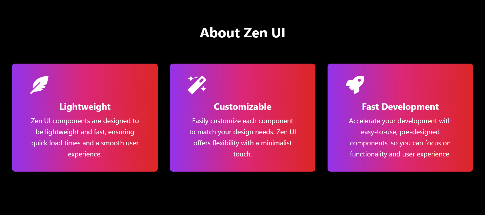
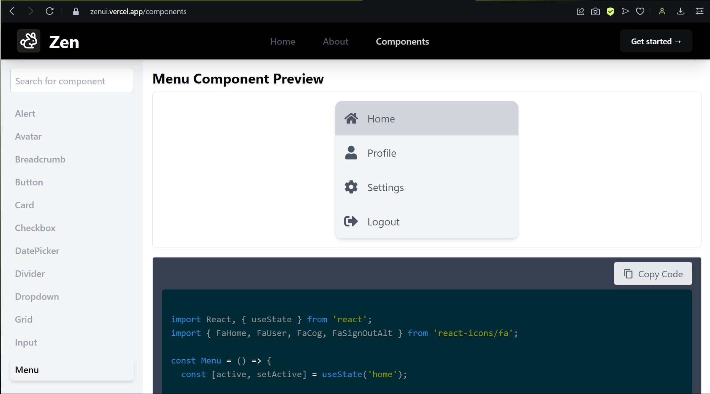
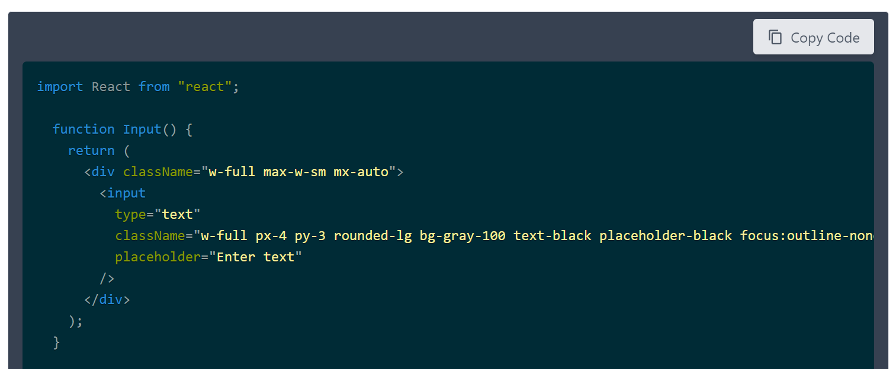

# **ZenUI**       


**ZenUI** is a minimalistic UI components library for React designed to be simple and elegant. This repository contains the website for ZenUI, where you can explore and interact with the various components in the library.




## **Explore ZenUI Components**

Our website showcases all the components available in ZenUI. Each component is displayed with a live preview and the corresponding code snippet, allowing you to see how it works and integrate it into your own projects.

### **Features**

- **Component Gallery**: Browse through a collection of UI components with a live preview of each.
- **Search**: Quickly find components using the search bar.
- **Code Copy**: Easily copy the code for each component to use in your projects.



### **How to Use the Website**

1. **Visit the ZenUI Website**: Navigate to the [ZenUI website↗️](https://zenui.vercel.app)

2. **Browse Components**: On the left side of the website, you will find a search bar at the top, followed by a list of all available components. Click on a component name to view its details.

   

3. **View and Copy Code**: On the right side, you will see a live preview of the selected component along with the code snippet used to create it. To copy the code:
   - Click the **"Copy Code"** button located at the top-right corner of the code preview.
   - The button will briefly change to **"Copied"** and display a tick mark icon to indicate that the code has been copied to your clipboard.

   

### **Development**
If you want to contribute to ZenUI or run the website locally, follow these steps:

1. **Clone the Repository**:
   ```bash
   git clone https://github.com/akshatbhj/zenui-web.git

2. **Navigate to the Project Directory**:
    ```bash
    cd zenui 

3. **Install Dependencies**:
    ```bash
    npm install


4. **Run the Development Server**:
    ```bash 
    npm start

This will start the development server and open the website in your default browser.

### **Contributing**
We welcome contributions to ZenUI! If you have ideas for new components, improvements, or bug fixes, please feel free to open an issue or submit a pull request.

1. **Fork the Repository**: Click on the "Fork" button at the top-right of this page.

2. **Create a New Branch**:
    ```bash
    git checkout -b my-feature-branch

3. **Make Your Changes and commit them**:
    ```bash
    git add .
    git commit -m "Add new feature or fix"

4. **Push Your Changes**:
    ```bash
    git push origin my-feature-branch

5. **Open a Pull Request**: Go to the repository on GitHub and click on the "New Pull Request" button.

### **License**
ZenUI is licensed under the MIT License. See the LICENSE file for more details.

### **Contact**
For any questions or support, please contact us at akshatbhj@gmail.com.